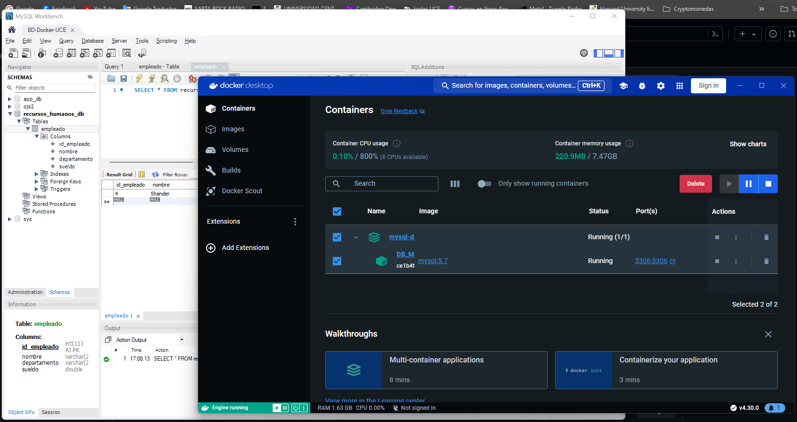

# Taller RestAPI
Integrantes:
Steven Benalcazar
Shander Sandoval

# TallerApi


Breve descripción del proyecto, explicando su propósito y funcionalidad.

## Índice

1. [Instalación](#instalación)
2. [Uso](#uso)
3. [Contribución](#contribución)
4. [Licencia](#licencia)
5. [Contacto](#contacto)

## Instalación

### Prerrequisitos

- Lista de software y versiones necesarias (por ejemplo, Python 3.8, Node.js)
- Instrucciones para instalar dependencias

### Pasos

1. Clona el repositorio:
    ```bash
    git clone https://github.com/tu_usuario/tu_proyecto.git
    ```
2. Entra en el directorio del proyecto:
    ```bash
    cd tu_proyecto
    ```
3. Instala las dependencias:
    ```bash
    npm install
    ```

## Uso

Explicación detallada de cómo usar el proyecto.

```bash
# Ejemplo de comando para ejecutar el proyecto
npm start
```

### Ejemplos

Incluir ejemplos prácticos con capturas de pantalla si es necesario.



## Contribución

### Cómo Contribuir

1. Haz un fork del proyecto.
2. Crea una rama con tu nueva funcionalidad (`git checkout -b nueva-funcionalidad`).
3. Realiza los cambios necesarios y haz commit (`git commit -am 'Agrega nueva funcionalidad'`).
4. Sube tus cambios a tu repositorio (`git push origin nueva-funcionalidad`).
5. Crea un Pull Request.

### Normas de Contribución

- Usa un estilo de código consistente con el proyecto.
- Documenta tu código.
- Asegúrate de que el proyecto funcione correctamente después de tus cambios.


Perfil de GitHub: [https://github.com/tu_usuario](https://github.com/stevenbenalcazar)

---

Espero que esta estructura te sea útil. No olvides reemplazar las secciones indicadas con la información específica de tu proyecto.

Para más información sobre este y otros proyectos, visita [https://chatgptonline.tech/es/](https://chatgptonline.tech/es/).

---

### Anuncio Aleatorio

- [Dibujos Para Colorear](https://www.google.es/search?q=colorearw.com)
